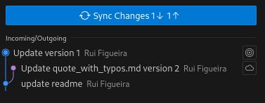

# Fundamentals of Agro-Environmental Data Science

# Exercise 3 - Collaborate with GitHub and manage merge conflicts

This is a learning/reading exercise, with several tasks. You should repeat and run all the examples given in your system, **adapted to your case**, and check that you obtain equivalent results.

> An exercise submission via Moodle is required once completed. The deadline for submissions is **11th October 2024**.

## Conventions of this document

In all commands, `$` indicates that it should be run at the operating system terminal. However, `$` is not part of the command and should not be included in the instruction.

The commands in this document assumes a bash terminal, but you can adapt the commands to CMD terminal.

## Introduction

Managing a data science project, in a team, frequently requires that several members collaborate in the same component of the project. If this is on a relational database, the DBMS manages possible conflicts caused by simultaneous access to the same table or the same record by two users. 

But imagine that two people are working on the code component of your project, for example, performing exploratory analysis. It is important that possible conflicts, caused by to people editing the same file, are also managed. Git and GitHub provides the perfect environment to manage these situations. 

Git, as seen before, manages versions of a file. In some sense, having two people editing the same file can be interpreted as the creation of two versions of the same file. So, one person creates version 1, and the other version 2. Therefore, Git can be used to manage these versions, and decide with version to keep. In some cases, it is not the full file of a version that will be kept, but there will lines from one version, and lines from the other, that should remain in the final file. This means that the **two initial versions need to be merged** in Git. GitHub, on the other hand, is the online platform that you can use to share code between the these two people.

In this exercise we will simulate a situation where two people are editing the same file.This will generate a conflict of versions that need to be merged. You will learn how to detect and solve these conflicts. Although these actions can be done in the command line, with git commands, we will use VS Code to do it.

For this exercise, we will use the following excerpt of the book "All the names", by José Saramago:

*“There are people like Senhor José everywhere, who fill their **time**, or what they believe to be their spare time, by collecting **stamps**, coins, medals, vases, postcards, matchboxes, **books**, clocks, sport shirts, autographs, stones, clay figurines, empty **beverage** cans, little angels, cacti, opera programmes, lighters, pens, owls, music boxes, **bottles**, bonsai trees, paintings, mugs, pipes, glass obelisks, ceramic **ducks**, old toys, carnival masks, and they probably do so out of something that we might call metaphysical angst, perhaps because they cannot bear the idea of chaos being the one ruler of the universe, which is why, using their limited powers and with no divine help, they attempt to impose some order on the world, and for a short while they manage it, but only as long as they are there to defend their collection, because when the day comes when it must be dispersed, and that day always comes, either with their death or when the collector grows weary, everything goes back to its beginnings, everything returns to chaos.”*

In this text, errors will be forced to the words highlighted in bold face.

## Pre-requisites

Make sure you have:
- installed **Git** in your system, as indicated in the [GreenDS Welcome-Kit](https://isa-ulisboa.github.io/greends-welcome-kit/)
- created a personal GitHub account, as indicated in the [GreenDS Welcome-Kit](https://isa-ulisboa.github.io/greends-welcome-kit/) 

## 1. Clone the repository

If you have not done so, clone to your local system the **greends-fads-first-project** repository that ou forked to your user in GitHub. That should be in the address `https://github.com/<YOUR GITHUB USERNAME>/greends-fads-first-project`.

Open that cloned repository locally with your VS Code editor.

## 2. Create two versions of the same file, generating a conflict

Now, you will make different edits of the same file, in different places, generating a conflict.

2.1. Open in your local repository VS Code the file **quote_with_typos.md**. Locate and correct the typos in the words `tiem`, `stmps`, `boks`, `beverge`. Save the file. This will be version 1.

2.2. Go to your repository in GitHub, open and edit the file **quote_with_typos.md**, using your browser. Locate and correct the typos in the words `beverge`, `botles`, `duccks`. Save the changes. This will be your version 2.

## 3. Pull and Create Conflict

3.1.  In your local repository, using the VS Code, do the equivalent to add and commit on the file **quote_with_typos.md**. Use the Source Control module for that.

3.2 Commit the staged file. Do not forget to add a message to this commit.

3.3. Push these changes in VS Code.  

3.4. A message will be raised, indicating you cannot push. You need to pull first.

3.5. Click on the "Sync Changes" button in the source control module in VS Code. 

## 4. Solve the conflict

Clicking on the sync changes, and then in the Show Command Output, you get the following message:

```
> git pull --tags origin main
From https://github.com/rpfigueira/greends-fads-first-project
 * branch            main       -> FETCH_HEAD
hint: You have divergent branches and need to specify how to reconcile them.
hint: You can do so by running one of the following commands sometime before
hint: your next pull:
hint:
hint:   git config pull.rebase false  # merge
hint:   git config pull.rebase true   # rebase
hint:   git config pull.ff only       # fast-forward only
hint:
hint: You can replace "git config" with "git config --global" to set a default
hint: preference for all repositories. You can also pass --rebase, --no-rebase,
hint: or --ff-only on the command line to override the configured default per
hint: invocation.
fatal: Need to specify how to reconcile divergent branches.
```

The history of commits will be shown in VS Code, with the two branches that need to be 
merged. One is version 1, edited locally, and the other is version 2, edited in the 
browser online. See the picture representing this:



If you click on the branch tree, a split window will appear in VS Code, with the part of the text that has conflicts, highlighted in red and green.

To solve the divergent branches:

4.1 Open a terminal inside VS Code and use the first hint command, to merge:
```
git config pull.rebase false
```
4.2. In the terminal, repeat a git pull command:
```
git pull
```
4.3. Look at your file **quote_with_typos.md**. It will show the two versions, one called *Current Change*, and another *Incoming Change*. On top of the windows, accept the one is preferred, to create a merged. 

4.4. Add, commit and pull the merged file to the online repository.

## 5. Submit your update repository to review
>
> Submit the URL of your forked GitHub repository to Moodle at [Exercise 3 submission](https://elearning.ulisboa.pt/mod/questionnaire/view.php?id=468434). Do this only after you push your local repository to the remote GitHub repository. 

## Wrap-up

In this exercise, we learned the very basics to use git and GitHub:
- what is version control
- config git
- use of `git status`
- create a new repository with `git init`
- the steps to update a repository: `git add`, `git commit`, `git push`
- create or fork a repository in GitHub
- `clone` a  repository
- update the local repository with `pull`

 
This concludes the current exercise.

## References

Palomino, Jenny, Wasser, Leah, & Joseph, Max. (2021). earthlab/earth-analytics-intro-to-earth-data-science-textbook: Earth Analytics Updated Version of the Intro Textbook (1.5). Zenodo. https://doi.org/10.5281/zenodo.4686073


