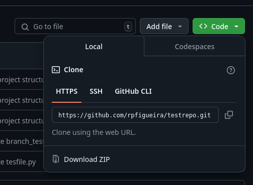
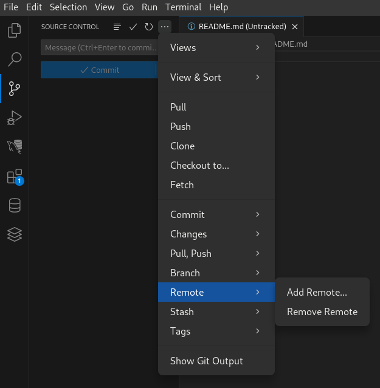

# Fundamentals of Agro-Environmental Data Science

# Exercise 4 - Data Science project management best practices

This is a reading exercise, with one task in the end.

> An exercise submission via Moodle is required once completed. The deadline for submissions is **11th October 2024**.

## Conventions of this document

In all commands, `$` indicates that it should be run at the operating system terminal. However, `$` is not part of the command and should not be included in the instruction.

The commands in this document assumes a bash terminal, but you can adapt the commands to CMD terminal.

## Introduction

Developing a data science project is similar to writing an article or book: you will create it for others to read. Therefore, it should follow the best conventions to make it easily understandable by others. But, while in the case of the book, others will only read the final, revised version, in a data science project, it is many times necessary to let others see to all the steps and components of the project. This is important in terms of reproducibility of the work done. Furthermore, it is likely that the project is done in collaboration, so every contributor should understand and be able to contribute following the same rules. Adopting best practices and conventions will facilitate the communication and understanding between teams and collaborators.

An important notice is that your project might be shared globally. This means that you should avoid, for example, to use settings, keyboard characters, etc, that only apply to a Portuguese keyboard or operating system, particularly in file names and directories.

## Organizing a data science project

Typically, in a data science project you will have:

- **raw data files**: files obtained from external sources or devices
- **processed files**: files transformed from the raw files
- **code and scripts**: the code for processing and analysis data, for example, jupyter notebooks
- **documentation**: information about the process, tools, options and decisions
- **outputs**: tables, figures, reports

It is a good idea to keep the raw data in the original format, and separated from processed files. This will facilitate if you want to repeat your calculations. To achieve this organization of files, you can create, for example, the following structure of directories:
```
/data-science-project
   /raw-data
   /processing-data
   /code-scripts
   /documentation
   /output-graphs
```
It is also important to give meaningful names to the directories and files. For example, if you create several python scripts, in the *code-scripts* directory above, these should be expressive of its content. Consider the following examples, in a dataset about temperatures:

| Expressive names | Non Expressive names |
|------------------|----------------------|
| 01-import-data-temp.py | open.py |
| 02-calculate-average-temp.py | mean.py |
| 03-create-plot-temp.py | plot.py |


## Good practice in naming files and directories

It is good practice to use file and directory names that are:

**Human-readable**

The directory structure above is auto-explicative, and is **human-readable**, i.e., easy to read for human eyes. The first item, **data-science-project**, is the parent directory, and all other are subdirectories.

**Machine-readable**

It is, however, important that names of directories and files are also **machine-readable**. This means to avoid special characters (e.g. ç Ç), accentuation (á Á), spaces, and other characters which might not be easily interpreted in all languages and operating systems. Furthermore, some characters are reserved (have a special meaning) in programming languages or operating system, making its use problematic. Therefore:

- Instead of spaces, use hyphens (`-`) or underscore (`_`). 
- do not use any of the following characters: **#%&{}\<>*?/$!'":;@+`|=** or other special characters
- most operating systems are case sensitive: use lower case.

**Sortable**

The third property that might be useful to ensure in naming files and directories it to make them **sortable**, i.e, by listing directories it created a sorted list. This can be achieved by placing a number as a prefix to the name of each directory or file, e.g. 01-raw-data, 02-processing-data, etc.

The advantage of applying these rules is that if you need to process many files and directories on a script or programme, these can be easily parsed or queried. For example, if you create a list of images from a camera trap that detect insects, the filenames can be:
```
  01-image.jpg
  02-image.jpg
  03-image.jpg
  04-image.jpg
  ...
```
which are easy to identify in a routine.

## Document your project

In addition to the documentation that you include inside your script files, you should create documents that include help, options, parameters and decisions. These files should be stored in the *documentation* directory, with a name that make them easy to link to the data, tool or code they refer to. These documentation files should be written in text, possibly in *markdown* format.

However, its important to create, at the top level directory, a documentation file that guide the users (and yourself) about the structure of the our project, and how to start. This file is normally called **README**. For example, GitHub uses this file as the primary documentation file that displays at the home of a repository. This file can be a text (*txt*) or markdown (*md*) file. We will discuss markdown in a latter class of the course.

Sometimes, it is also useful to have one readme file per subdirectory, particularly in large projects.

## Use of open file formats

Avoid to use proprietary formats for your data, documentation or code files. This makes your project more accessible to anyone, because files are not locked to a specific application or operating system. You can use text files for your data tables (as *csv*), code (as *py* or *ipynb*, for Jupyter Notebooks), or documents (as *txt* or *md*, for markdown documents). There are certain types of data that require binary formats (*netCDF* for climate data, *tiff* for images) which are not locked to a specific vendor.

## Summary of best practices

In summary, in order to have your data science project organized following the best practices, you should:
- Use consistent computer readable naming conventions
- Be consistent when naming files - use lower case
- Organize your project directories to make it easy to find data, code and outputs
- Use meaningful (expressive) file and directory Names
- Document your project with a **README.md** file
- Don’t use proprietary file formats

## Further reading

If you want to check a more complex data project structure, for inspiration, check [https://github.com/drivendata/cookiecutter-data-science](https://github.com/drivendata/cookiecutter-data-science). 

## Task 1. Create project structure
Create a new structure for your data project as a template, with the necessary directories:
- use the proposed layout for the structure in the blog post [Best Practices For Data Science Project Workflows and File Organizations](https://neptune.ai/blog/best-practices-for-data-science-project-workflows-and-file-organizations)
- create using the shell terminal / command line
   - do not forget to include necessary **README.md** files, because empty directories are not added to the repository

## Task 2. Set as Git repository and add remote repository

- inside the main folder of your new project, initialize the project as a git repository, doing in the command line
```
$ git init
```
- open this project in VS Code. You can open the software from the terminal with the following command
```
$ code .
``` 
- create in your GitHub account, with the browser interface, a new repository to which this new structure will be added. Call it **project-template**
- in the new repository created in GitHub, copy the **Code** address for HTTPS protocol

- in VS Code open in the local project, add the remote repository. To do so, open the menu of the Source control, do Add Remote as shown in the image, and paste the clone address.


- do `git add`, `git commit` and `git pull`, for your README.md files as you usually do
- the repository should now be sync with the remote at GitHub. Check by going to the browser and doing a refresh

## Task 3. Submit your update repository
> Submit the URL of your forked GitHub repository to Moodle at [Exercise 4 submission](https://elearning.ulisboa.pt/mod/questionnaire/view.php?id=468940). Do this only after you push your local repository to the remote GitHub repository. 


## Wrap-up

In this exercise, we learned some guidelines and best practices:
- organize directories and files in a data science project
- give meaningful names to files and directories
- make file and directory names human-readable, machine-readable, and sortable
- document your project
- open file formats
 
This concludes the current exercise.

## References

Palomino, Jenny, Wasser, Leah, & Joseph, Max. (2021). earthlab/earth-analytics-intro-to-earth-data-science-textbook: Earth Analytics Updated Version of the Intro Textbook (1.5). Zenodo. https://doi.org/10.5281/zenodo.4686073


